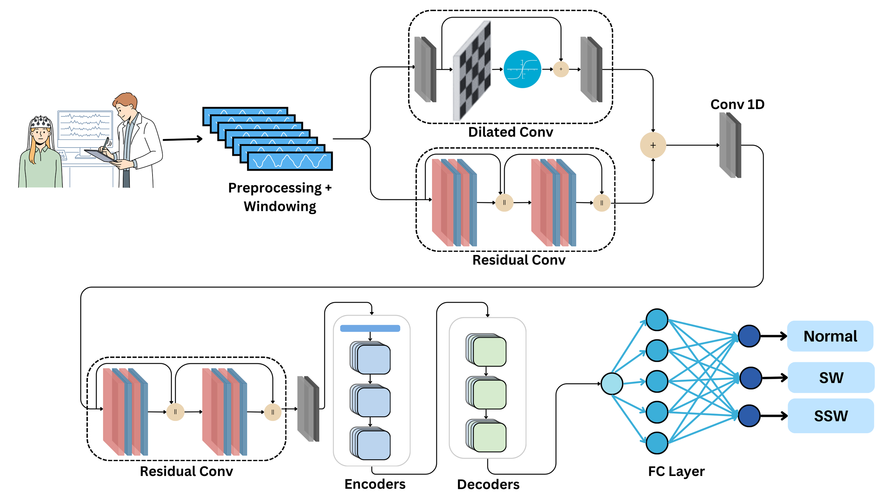

# Neurotransformer

**Neurotransformer** is a lightweight hybrid convolution–transformer network (0.98 M parameters) that classifies
**single-channel EEG windows**: 2 s at 200 Hz, i.e. input shape `(batch, 1, 400)`. It detects epileptiform
events and abnormal activity in scalp EEG.

This repository contains:

- the model and six ablation variants (`neurotransformer/models/`)
- preprocessing for the Bonn and TUEV datasets, plus the expected format for NMT events
- training, evaluation and benchmarking scripts with the paper's hyperparameters (`configs/`)
- notebooks covering preprocessing, training, ablations, visualisation and inference cost

## Architecture



A preprocessed single-channel EEG window is fed to two blocks in parallel: the **Dilated Convolution Block** and
the **Residual Convolution Block**. Their outputs are added element-wise. The merged feature map goes through
spatial dropout and 1D convolutions, then a second Residual Convolution Block, with batch normalization and max
pooling that reduce the sequence length by 4×. The resulting sequence (100 steps × 32 features) passes through a
Transformer encoder and decoder. A fully connected layer maps the decoder output to the classes.

| Component | Paper | Code (`neurotransformer/models/`) | Details |
|---|---|---|---|
| Residual Convolution Block | §3.2.1 | `MFFMBlock` | Two Conv1D (k = 5) – BN – ReLU layers; each output is concatenated with its input |
| Dilated Convolution Block | §3.2.2 | `WaveBlock` / `WaveLayer` | Pointwise conv, then WaveLayers with dilations 2⁰ … 2⁴ (k = 3), gating `z = tanh(W_f ∗ x) ⊙ σ(W_g ∗ x)`, pointwise conv and residual addition |
| Transformer encoder | §3.2.3 | `Neurotransformer.encoder` | 3 layers, d_model = 32, 8 heads |
| Transformer decoder | §3.2.3 | `Neurotransformer.transformer_decoder` | 3 layers, d_model = 32, 8 heads. A learnable classification token (CLS) is the decoder query and cross-attends to the encoder output |
| FC layer | §3.2.3 | `Neurotransformer.fc` | Maps the CLS representation to the class logits |

## Installation

```bash
git clone <this-repo-url> Neurotransformer
cd Neurotransformer
pip install -e .            # core: torch, numpy, scipy, scikit-learn, pandas, pyyaml, tqdm
pip install -e ".[all]"     # + mne, matplotlib, thop, jupyter (preprocessing, plots, FLOPs, notebooks)
```

Python ≥ 3.8 and PyTorch ≥ 1.12 are required. Install the PyTorch build that matches your CUDA version first, following
[pytorch.org](https://pytorch.org/get-started/locally/).

## Quick start

```python
import torch
from neurotransformer import build_model

model = build_model("neurotransformer", n_classes=3).eval()
x = torch.randn(8, 1, 400)          # 8 windows, 1 channel, 2 s at 200 Hz
logits = model(x)                   # (8, 3)
```

## Datasets

The datasets are not redistributed here. Each one is turned into one `.npz` file per window under
`data/<dataset>/{train,eval,test}/`.

| Dataset | Task | Classes | Windows (train / eval / test) |
|---|---|---|---|
| **NMT events** | 3-class | Normal · SW · SSW | 215,209 / 38,440 / 65,333 |
| **Bonn** ([Andrzejak et al., 2001](https://doi.org/10.1103/PhysRevE.64.061907)) | 3-class | Normal (A/Z, B/O) · Interictal (C/N, D/F) · Ictal (E/S) | 7,700 / 1,650 / 1,650 |
| **TUEV** ([TUH EEG Events](https://isip.piconepress.com/projects/nedc/html/tuh_eeg/)) | binary | Non-epileptic (EYEM, ARTF, BCKG) · Epileptic (SPSW, GPED, PLED) | train / eval (official split) |

**Bonn:** download the five sets (Z, O, N, F, S; 100 × 23.6 s recordings each), then run:

```bash
python scripts/preprocess_bonn.py --raw-dir /path/to/bonn --out data/bonn
```

The script resamples 173.61 Hz → 200 Hz, applies a 1–45 Hz band-pass filter (Hamming-windowed FIR) and a fixed
scaling factor (`--scale`, default 1 because Bonn is already in µV), and cuts 2 s windows with 50 % overlap.
Recordings are split *before* windowing, so no recording appears in two splits. By default it uses the exact
record split from the experiments, [`configs/splits/bonn_split.json`](configs/splits/bonn_split.json). Pass
`--split-file none --seed <n>` to draw a new stratified 70/15/15 split.

**TUEV:** request access from the Neural Engineering Data Consortium, then run:

```bash
python scripts/preprocess_tuev.py --root /path/to/tuev/v2.0.1 --out data/tuev
```

For each recording the script:
1. standardises channel names, clips the signal to ±100 µV (`--clip-uv`), resamples 250 Hz → 200 Hz and applies
   a 1–45 Hz band-pass filter (Hamming-windowed FIR);
2. removes muscle and eye-movement components with ICA (FastICA; `--no-ica` skips this for quick tests);
3. builds the 22-channel TCP bipolar montage that the `.rec` channel numbers refer to, scaled to µV;
4. windows every channel independently (2 s, 50 % overlap). A window is *epileptic* when its overlap with an
   SPSW/GPED/PLED annotation on that channel exceeds τ = 0.25 of the window (`--tau`), *non-epileptic* when it
   overlaps other annotations only, and dropped when it overlaps no annotation.

TUEV has no test split, so `eval` is used for model selection and reporting.

**NMT events:** windows are derived from the NMT Scalp EEG dataset using its event annotations. Put them in
`data/nmt/{train,eval,test}/`. Each file needs:
- keys `data` (float, shape `(1, 400)`, 200 Hz) and `ab_label` (0 = normal; 1 and 3 → SW; 2 → SSW)
- for the recording-level plots in `notebooks/04_visualization.ipynb`, also `channel`, `beg` and `end`
- file names starting with the recording id, e.g. `0000011_0_0_FZ_0.npz`

## Training and evaluation

```bash
# Train (best checkpoint + history + metrics go to runs/<dataset>/<model>/)
python scripts/train.py --config configs/bonn.yaml
python scripts/train.py --config configs/nmt.yaml  --data-root /data/nmt
python scripts/train.py --config configs/tuev.yaml --epochs 50

# Evaluate a checkpoint on a split; metrics are appended to a CSV
python scripts/evaluate.py --config runs/bonn/neurotransformer/config.yaml \
    --checkpoint runs/bonn/neurotransformer/best.pth --split test
```

All three configs use the training setup from the paper:

| Setting | Value |
|---|---|
| Optimizer | Adam, lr 1e-3, β = (0.9, 0.98), ε = 1e-9 |
| Batch size | 32 |
| Epochs | up to 100, early stopping on validation loss (patience 10) |
| Loss | weighted cross-entropy, inverse-frequency class weights from the training split |

The best checkpoint is the one with the lowest validation loss. Override values from the command line with
`--epochs`, `--patience`, `--batch-size` and `--model`; add `--seed <n>` for a reproducible run. The scripts
report accuracy, precision, recall, F1, specificity and AUROC:
- **Three classes:** macro-averaged metrics and one-vs-rest AUROC.
- **Binary:** metrics are for the positive (epileptiform) class.

## Ablation variants

Every variant has the same interface: `build_model(name, n_classes)`. Pass `--model <name>` to `train.py`, or run
`notebooks/03_ablation_study.ipynb` to train them all.

| Name | Removed component | Parameters |
|---|---|---|
| `neurotransformer` | – (full model) | 975,439 |
| `wo_res` | residual multi-scale convolutions (MFFM) | 963,199 |
| `wo_dil` | dilated gated convolution branch | 859,091 |
| `wo_conv` | whole convolutional front end | 838,083 |
| `wo_encoder` | transformer encoder | 562,927 |
| `wo_decoder` | `[CLS]` transformer decoder (mean pooling instead) | 550,031 |
| `wo_trans` | encoder and decoder (fully convolutional) | 141,621 |

Parameter counts are for 3 classes. `python scripts/benchmark.py` also reports FLOPs and CPU/GPU latency on your
hardware.

## Notebooks

| Notebook | Contents |
|---|---|
| [`01_preprocessing`](notebooks/01_preprocessing.ipynb) | Build the `.npz` windows and inspect class balance |
| [`02_train_evaluate`](notebooks/02_train_evaluate.ipynb) | Train, plot learning curves, confusion matrices and ROC curves |
| [`03_ablation_study`](notebooks/03_ablation_study.ipynb) | Train and compare all ablation variants |
| [`04_visualization`](notebooks/04_visualization.ipynb) | Per-electrode topomaps and EEG traces with predictions (NMT) |
| [`05_inference_cost`](notebooks/05_inference_cost.ipynb) | Parameters, FLOPs and latency |

## Repository layout

```
neurotransformer/        installable package
  models/                Neurotransformer, blocks, ablation variants, registry
  data/                  dataset class, label maps, TUEV/Bonn preprocessing
  engine.py              training loop, evaluation and metrics
  benchmark.py           parameters, FLOPs, latency
  visualization.py       confusion matrix, ROC, topomaps, EEG traces
configs/                 per-dataset hyperparameters and the Bonn record split
scripts/                 command-line entry points
notebooks/               walkthrough notebooks
```

## License

Released under the [MIT License](LICENSE).
